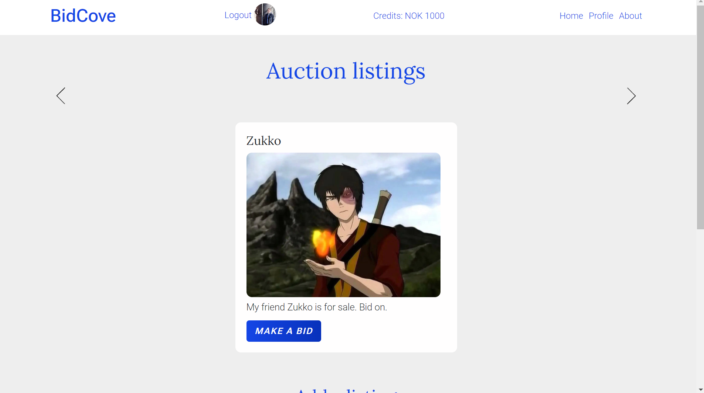

# auction-site
 Semester project 2 Noroff

# semester-project-1



Noroff course assignment project

## Description

The project's goal is to reflect the skills learned in the first three semesters. This includes design principles, project management,developing with HTML/CSS and CSS frameworks. 

## Built With

- [HTML]
- [CSS]
- [Javascript]
- [Bootstrap 5]

## Getting Started

To clone the project and get it started, please follow these steps:

1. Clone the repo:

```bash
git clone https://github.com/tnjensen/auction-site.git
```

2. Install the dependencies:

```
npm install
```

### Running

To see the site, please visit:

https://stellular-lamington-d5dc71.netlify.app/

## Contact

[My LinkedIn page](https://www.linkedin.com/in/tnjensen09/)